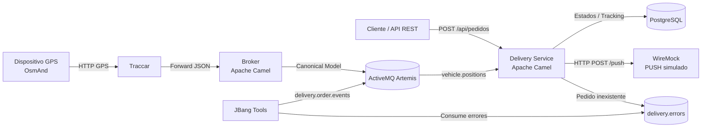

# Traccar Fleet Integration – Seguimiento de Pedidos con GPS

Proyecto de integración orientado a eventos para el seguimiento de pedidos y repartidores mediante GPS.

La solución extiende el proyecto base **Traccar Fleet Integration** incorporando lógica de negocio para delivery:

- recepción de pedidos mediante API REST;
- asignación de pedidos a repartidores;
- recepción de posiciones GPS reales mediante Traccar;
- transformación de datos a un modelo canónico;
- publicación y consumo de eventos mediante Apache ActiveMQ Artemis;
- correlación entre repartidor y pedido;
- cálculo de distancia mediante Haversine;
- máquina de estados del pedido;
- persistencia en PostgreSQL;
- notificaciones PUSH simuladas mediante WireMock;
- procesamiento idempotente;
- manejo de errores mediante Dead Letter Queue;
- herramientas de prueba con JBang;
- pruebas end-to-end automatizadas con PowerShell.

Repositorio:

```text
https://github.com/Alezv21/traccar-fleet-integration
```

---

# 1. Tecnologías utilizadas

La solución utiliza:

- Java 21
- Apache Camel 4.8.0
- Gradle 9.6
- Apache ActiveMQ Artemis 2.31.2
- PostgreSQL 16
- Traccar
- WireMock
- JBang
- Docker
- Docker Compose
- PowerShell
- Python para los scripts originales de simulación GPS

---

# 2. Objetivo

El objetivo del proyecto es implementar una arquitectura de integración orientada a eventos para realizar el seguimiento de pedidos asignados a repartidores.

Cada repartidor posee un identificador GPS.

Cuando Traccar recibe una nueva posición:

1. Traccar reenvía el mensaje al broker de integración.
2. Apache Camel clasifica el mensaje.
3. La posición es transformada a un modelo canónico.
4. El mensaje es publicado en Artemis.
5. `delivery-service` consume el evento.
6. Se correlaciona `deviceId` con el pedido activo.
7. Se calcula la distancia hasta el destino.
8. Se actualiza el estado del pedido.
9. Se persiste la última ubicación en PostgreSQL.
10. Si corresponde, se genera una notificación PUSH.

---

# 3. Arquitectura



---

# 4. Flujo principal

El flujo principal de seguimiento es:

```text
GPS
 ↓
Traccar
 ↓
Broker Apache Camel
 ↓
Transformación al modelo canónico
 ↓
Artemis
vehicle.positions
 ↓
Delivery Service
 ↓
Correlación deviceId ↔ pedido
 ↓
Haversine
 ↓
Máquina de estados
 ↓
PostgreSQL
 ↓
PUSH
 ↓
WireMock
```

---

# 5. Estados del pedido

Los pedidos utilizan la siguiente máquina de estados:

```text
RECIBIDO
   ↓
EN_CAMINO
   ↓
CERCA
   ↓
ENTREGADO
```

También existe el estado:

```text
CANCELADO
```

aunque no forma parte del flujo GPS demostrado en este trabajo.

## RECIBIDO

El pedido fue creado correctamente y asignado a un repartidor.

## EN_CAMINO

Se recibe la primera posición GPS válida del repartidor.

## CERCA

La distancia calculada entre el repartidor y el destino es menor o igual al radio configurado.

Para la demostración:

```text
radioLlegadaM = 150 metros
```

## ENTREGADO

La distancia entre el repartidor y el destino es:

```text
<= 30 metros
```

---

# 6. Cálculo de distancia

La distancia entre la posición GPS y el destino se calcula mediante la fórmula de Haversine.

La implementación considera el radio terrestre aproximado:

```text
6.371.000 metros
```

Esto permite calcular la distancia geográfica entre:

```text
(latitudActual, longitudActual)
```

y:

```text
(latitudDestino, longitudDestino)
```

---

# 7. Modelo canónico de posición

Las posiciones provenientes de Traccar son transformadas antes de publicarse en Artemis.

Ejemplo:

```json
{
  "schemaVersion": "1.0",
  "messageId": "uuid",
  "deviceId": "repartidor-01",
  "timestamp": "2026-09-13T23:44:17Z",
  "latitude": -25.2998,
  "longitude": -57.6300,
  "speedKmh": 22.224,
  "course": 45.0,
  "valid": true,
  "attributes": {
    "ignition": true
  }
}
```

El uso de un modelo canónico evita que los consumidores dependan directamente del formato utilizado internamente por Traccar.

---

# 8. Correlación pedido – repartidor

Cada pedido contiene:

```text
repartidor_device_id
```

La posición canónica contiene:

```text
deviceId
```

Por ejemplo:

```text
Pedido:
PED-DEMO-001
repartidor_device_id = repartidor-01
```

Posición:

```text
deviceId = repartidor-01
```

El sistema busca un pedido activo del repartidor con estado:

```text
RECIBIDO
EN_CAMINO
CERCA
```

Si no existe un pedido activo, la posición se consume pero no genera cambios de estado.

---

# 9. API REST

El servicio de delivery expone una API REST mediante Apache Camel.

Host local:

```text
http://localhost:8081
```

---

## Crear pedido

```http
POST /api/pedidos
```

Ejemplo:

```powershell
$body = @{
    id = "PED-001"
    clienteNombre = "Cliente Demo"
    clienteMsisdn = "+595981555555"
    clienteFcmId = "fcm-demo-001"
    direccionTexto = "San Lorenzo - Pedido Demo"
    latDestino = -25.3000
    lonDestino = -57.6300
    radioLlegadaM = 150
    repartidorDeviceId = "repartidor-01"
} | ConvertTo-Json

Invoke-RestMethod `
    -Method POST `
    -Uri "http://localhost:8081/api/pedidos" `
    -ContentType "application/json" `
    -Body $body
```

Respuesta esperada:

```json
{
  "id": "PED-001",
  "estado": "RECIBIDO",
  "repartidorDeviceId": "repartidor-01",
  "mensaje": "Pedido recibido correctamente"
}
```

---

## Consultar tracking

```http
GET /api/pedidos/{id}/tracking
```

Ejemplo:

```powershell
Invoke-RestMethod `
    -Method GET `
    -Uri "http://localhost:8081/api/pedidos/PED-001/tracking"
```

Ejemplo de respuesta:

```json
{
  "id": "PED-001",
  "estado": "ENTREGADO",
  "repartidorDeviceId": "repartidor-01",
  "clienteNombre": "Cliente Demo",
  "direccionTexto": "San Lorenzo - Pedido Demo",
  "latDestino": -25.3000,
  "lonDestino": -57.6300,
  "radioLlegadaM": 150,
  "ultimaLatitud": -25.2998,
  "ultimaLongitud": -57.6300,
  "ultimaVelocidadKmh": 3.704,
  "distanciaDestinoM": 22.24
}
```

---

# 10. Simulación GPS mediante Traccar

El proyecto utiliza el protocolo OsmAnd de Traccar.

Puerto:

```text
5055
```

Ejemplo:

```powershell
curl.exe "http://localhost:5055/?id=repartidor-01&lat=-25.2967&lon=-57.6359&speed=12&bearing=45&altitude=80&ignition=true"
```

---

## Posición inicial

Aproximadamente 697 metros del destino:

```powershell
curl.exe "http://localhost:5055/?id=repartidor-01&lat=-25.2967&lon=-57.6359&speed=12&bearing=45&altitude=80&ignition=true"
```

Produce:

```text
RECIBIDO → EN_CAMINO
```

---

## Posición CERCA

Aproximadamente 111 metros:

```powershell
curl.exe "http://localhost:5055/?id=repartidor-01&lat=-25.2990&lon=-57.6300&speed=8&bearing=45&altitude=80&ignition=true"
```

Produce:

```text
EN_CAMINO → CERCA
```

---

## Posición ENTREGADO

Aproximadamente 22 metros:

```powershell
curl.exe "http://localhost:5055/?id=repartidor-01&lat=-25.2998&lon=-57.6300&speed=2&bearing=45&altitude=80&ignition=true"
```

Produce:

```text
CERCA → ENTREGADO
```

---

# 11. Apache ActiveMQ Artemis

Artemis funciona como middleware de mensajería.

Principales destinos utilizados:

| Destino | Tipo | Función |
|---|---|---|
| `ingest` | Queue | Entrada inicial del broker |
| `vehicle.positions` | Topic | Posiciones GPS canónicas |
| `vehicle.events` | Topic | Eventos provenientes de Traccar |
| `delivery.order.events` | Queue | Eventos externos relacionados con pedidos |
| `delivery.errors` | Queue | Mensajes que no pueden procesarse |

El servicio `delivery-service` posee una suscripción durable a:

```text
vehicle.positions
```

Esto desacopla la recepción GPS de la lógica del pedido.

---

# 12. PostgreSQL

PostgreSQL almacena el estado del proceso de delivery.

Base:

```text
delivery
```

Usuario:

```text
delivery
```

Puerto externo:

```text
55432
```

---

## Tabla `repartidores`

Contiene los repartidores disponibles.

Ejemplo:

```text
repartidor-01
repartidor-02
```

Los repartidores son cargados mediante el script inicial de PostgreSQL.

No se implementa un CRUD de repartidores porque no forma parte del objetivo del trabajo.

---

## Tabla `pedidos`

Almacena:

- ID del pedido;
- información del cliente;
- destino;
- repartidor;
- estado;
- radio de llegada;
- fechas de creación y actualización.

---

## Tabla `pedido_ultima_posicion`

Guarda la última posición GPS asociada al pedido:

- pedido;
- dispositivo;
- latitud;
- longitud;
- velocidad;
- distancia al destino;
- timestamp.

---

## Tabla `pedido_eventos`

Registra los hitos:

```text
RECIBIDO
EN_CAMINO
CERCA
ENTREGADO
```

Existe una restricción:

```text
UNIQUE(pedido_id, hito)
```

que evita generar dos veces el mismo hito.

---

## Tabla `mensajes_procesados`

Se utiliza para implementar el patrón:

```text
Idempotent Receiver
```

La clave primaria es:

```text
message_id
```

Si se recibe nuevamente el mismo mensaje, no se vuelve a aplicar la lógica de negocio.

---

# 13. PUSH simulado con WireMock

WireMock representa un proveedor externo de notificaciones PUSH.

Endpoint:

```text
POST /push
```

Host local:

```text
http://localhost:8089
```

Ejemplo de notificación:

```json
{
  "notificationId": "PED-001:CERCA",
  "pedidoId": "PED-001",
  "hito": "CERCA",
  "titulo": "Tu pedido esta cerca",
  "mensaje": "El repartidor esta muy cerca de tu destino.",
  "cliente": "Cliente Demo",
  "msisdn": "+595981555555",
  "fcmId": "fcm-demo-001"
}
```

Se generan notificaciones para:

```text
EN_CAMINO
CERCA
ENTREGADO
```

`RECIBIDO` no genera PUSH.

---

# 14. Garantía de notificación At-Most-Once

La solución utiliza una estrategia de notificación:

```text
AT-MOST-ONCE
```

Cada registro de `pedido_eventos` posee:

```text
notificado
```

El proceso de notificación busca:

```sql
notificado = false
```

para los hitos:

```text
EN_CAMINO
CERCA
ENTREGADO
```

Antes del envío HTTP, el evento es reclamado y marcado como:

```text
notificado = true
```

De esta manera, el mismo hito no vuelve a enviarse en ejecuciones posteriores del timer.

## Trade-off

Esta estrategia prioriza:

```text
no duplicar notificaciones
```

sobre:

```text
reintentar indefinidamente un PUSH fallido
```

Por lo tanto, cumple semántica:

```text
At-Most-Once
```

y no `At-Least-Once`.

---

# 15. Dead Letter Queue

Se implementó un flujo de manejo de errores utilizando:

```text
delivery.order.events
```

y:

```text
delivery.errors
```

Flujo:

```text
Evento de pedido
      ↓
delivery.order.events
      ↓
Apache Camel
      ↓
¿Existe pedido?
   /       \
 Sí         No
 ↓           ↓
OK      delivery.errors
```

Si el evento referencia un pedido inexistente:

```text
PED-NO-EXISTE
```

se agrega:

```text
errorType = PEDIDO_INEXISTENTE
```

y el mensaje es enviado a:

```text
delivery.errors
```

---

# 16. JBang

JBang se utiliza para ejecutar herramientas Java sin crear un proyecto adicional.

Scripts:

```text
scripts/OrderEventTool.java
scripts/PositionTool.java
```

---

## Publicar evento de pedido inexistente

```powershell
jbang .\scripts\OrderEventTool.java send
```

Ejemplo:

```text
[OK] Evento enviado
Queue: delivery.order.events
EventId: EVT-ERROR-...
Pedido: PED-NO-EXISTE
```

---

## Consumir Dead Letter Queue

```powershell
jbang .\scripts\OrderEventTool.java receive
```

Ejemplo:

```text
[OK] Mensaje encontrado en DLQ
errorType: PEDIDO_INEXISTENTE
```

---

## Publicar posición manualmente

```powershell
jbang `
    .\scripts\PositionTool.java `
    DEMO-001 `
    repartidor-01 `
    -25.2967 `
    -57.6359 `
    22.224
```

Esto permite probar directamente el canal:

```text
vehicle.positions
```

---

# 17. Enterprise Integration Patterns utilizados

El proyecto implementa varios patrones de integración.

## Messaging Endpoint

Apache Camel expone y consume distintos endpoints:

```text
REST
AMQP
HTTP
Timer
```

---

## Canonical Data Model

Los datos provenientes de Traccar son convertidos a:

```text
VehiclePosition
```

evitando que los servicios consumidores dependan del formato original.

---

## Message Translator

El broker transforma el JSON recibido desde Traccar hacia el modelo canónico.

---

## Publish / Subscribe

Las posiciones se publican en:

```text
vehicle.positions
```

como topic.

Esto permite que varios consumidores puedan reaccionar a la misma posición.

---

## Durable Subscriber

`delivery-service` utiliza una suscripción durable a:

```text
vehicle.positions
```

---

## Content Based Router

Los mensajes son clasificados según su contenido.

También se utiliza para decidir si un evento de pedido:

```text
pedido existe
```

o:

```text
pedido no existe
```

---

## Correlation Identifier

El campo:

```text
deviceId
```

permite correlacionar una posición GPS con el repartidor y su pedido activo.

---

## Idempotent Receiver

El campo:

```text
messageId
```

se registra en:

```text
mensajes_procesados
```

para evitar reprocesamientos.

---

## Splitter

El dispatcher de notificaciones obtiene varios eventos pendientes y los procesa individualmente.

```text
Lista de notificaciones
        ↓
     Splitter
   /     |     \
 PUSH   PUSH   PUSH
```

---

## Dead Letter Channel

Los eventos correspondientes a pedidos inexistentes son enviados a:

```text
delivery.errors
```

---

# 18. Orquestación vs Coreografía

Para la lógica principal del delivery se utiliza principalmente:

```text
ORQUESTACIÓN
```

El `delivery-service` concentra las reglas relacionadas con:

- correlación del repartidor;
- búsqueda del pedido;
- cálculo de distancia;
- transición de estados;
- almacenamiento;
- generación de hitos;
- notificaciones.

Esta decisión evita distribuir la máquina de estados entre múltiples servicios.

Sin embargo, la comunicación de posiciones utiliza un enfoque desacoplado orientado a eventos:

```text
Traccar
  ↓
Broker
  ↓
Artemis
  ↓
Consumers
```

Por lo tanto, la solución combina:

```text
arquitectura orientada a eventos
+
orquestación de la lógica de negocio
```

---

# 19. Comunicación síncrona y asíncrona

## Síncrona

Se utiliza para:

```text
Cliente → POST /api/pedidos → Delivery Service
```

```text
Cliente → GET /tracking → Delivery Service
```

```text
Delivery Service → WireMock PUSH
```

---

## Asíncrona

Se utiliza para:

```text
Broker → Artemis → Delivery Service
```

y:

```text
JBang → Artemis → Delivery Service
```

Esto desacopla productores y consumidores.

---

# 20. Servicios Docker

La solución completa contiene los siguientes servicios:

```text
artemis
traccar
broker
positions-consumer
events-consumer
delivery-service
postgres
wiremock
```

Puertos principales:

| Servicio | Puerto |
|---|---:|
| Broker REST | 8080 |
| Delivery API | 8081 |
| Traccar Web | 8082 |
| WireMock | 8089 |
| Artemis Console | 8161 |
| Artemis | 61616 |
| PostgreSQL | 55432 |
| OsmAnd | 5055 |
| GPS103 | 5001 |
| TK103 | 5002 |

---

# 21. Ejecutar proyecto

## Requisitos

Se necesita:

```text
Java 21+
Docker
Docker Compose
JBang
PowerShell
```

Opcionalmente:

```text
Python 3
```

para ejecutar los scripts originales.

---

## Verificar Java

```powershell
java -version
```

---

## Verificar Docker

```powershell
docker --version
docker compose version
```

---

## Verificar JBang

```powershell
jbang --version
```

---

# 22. Compilar

En Windows:

```powershell
.\gradlew.bat clean build
```

O únicamente `delivery-service`:

```powershell
.\gradlew.bat `
    :delivery-service:clean `
    :delivery-service:build
```

---

# 23. Levantar infraestructura

```powershell
docker compose up -d --build
```

Consultar estado:

```powershell
docker compose ps
```

---

# 24. Logs

Todos:

```powershell
docker compose logs -f
```

Delivery:

```powershell
docker compose logs -f delivery-service
```

Broker:

```powershell
docker compose logs -f broker
```

Consumidores:

```powershell
docker compose logs -f positions-consumer events-consumer
```

---

# 25. Prueba automatizada end-to-end

El proyecto incluye:

```text
scripts/demo.ps1
```

Este script ejecuta automáticamente todos los escenarios principales del trabajo.

Ejecutar:

```powershell
powershell `
    -ExecutionPolicy Bypass `
    -File .\scripts\demo.ps1
```

Resultado esperado:

```text
====================================================
RESULTADO FINAL
====================================================

TODAS LAS PRUEBAS FINALIZARON CORRECTAMENTE

Resultado: 10/10 casos OK
```

---

# 26. Casos de prueba

## Caso 1 – Pedido RECIBIDO

Verifica:

```text
POST /api/pedidos
```

Resultado:

```text
RECIBIDO
```

---

## Caso 2 – GPS y modelo canónico

Se envía una posición mediante Traccar.

Se verifica que:

```text
GPS
→ Traccar
→ Broker
→ Artemis
→ Delivery Service
→ PostgreSQL
```

funcione correctamente.

---

## Caso 3 – EN_CAMINO

Primera posición válida:

```text
RECIBIDO → EN_CAMINO
```

Se verifica un único PUSH.

---

## Caso 4 – CERCA

Posición aproximada:

```text
111.19 metros
```

Resultado:

```text
EN_CAMINO → CERCA
```

Se genera exactamente un nuevo PUSH.

---

## Caso 5 – ENTREGADO

Posición aproximada:

```text
22.24 metros
```

Resultado:

```text
CERCA → ENTREGADO
```

Se genera exactamente un nuevo PUSH.

---

## Caso 6 – Idempotencia

Se publica dos veces:

```text
messageId = DEMO-DUP-001
```

Resultado:

```text
1 mensaje procesado
0 hitos duplicados
0 PUSH duplicados
```

---

## Caso 7 – GPS sin pedido activo

Se envía una posición cuando el pedido ya está:

```text
ENTREGADO
```

Resultado:

```text
mensaje consumido
pedido no modificado
ningún nuevo hito
```

---

## Caso 8 – Repartidor desconocido

Se intenta crear un pedido para:

```text
repartidor-inexistente
```

Resultado:

```text
HTTP 400
```

y el pedido no se persiste.

---

## Caso 9 – Pedido inexistente y DLQ

JBang publica un evento con:

```text
pedidoId = PED-NO-EXISTE
```

Camel lo enruta hacia:

```text
delivery.errors
```

con:

```text
errorType = PEDIDO_INEXISTENTE
```

---

## Caso 10 – Tracking

Se consulta:

```text
GET /api/pedidos/PED-DEMO-001/tracking
```

Resultado esperado:

```text
estado = ENTREGADO
deviceId = repartidor-01
distancia <= 30 metros
última posición disponible
```

---

# 27. Resultado de pruebas

La ejecución completa obtuvo:

```text
10/10 casos OK
```

Estado final:

```text
Pedido:
PED-DEMO-001

Estado:
ENTREGADO

Repartidor:
repartidor-01

Última posición:
-25.2998, -57.6300

Distancia:
22.24 metros
```

Historial:

```text
RECIBIDO
EN_CAMINO
CERCA
ENTREGADO
```

Notificaciones:

```text
RECIBIDO  -> no
EN_CAMINO -> sí
CERCA     -> sí
ENTREGADO -> sí
```

---

# 28. Scripts originales

El proyecto base también contiene scripts Python para realizar pruebas sobre Traccar.

---

## `test-generator.py`

Simula movimiento continuo de un vehículo enviando posiciones GPS mediante OsmAnd.

Ejemplo:

```bash
python3 scripts/test-generator.py
```

Personalizado:

```bash
python3 scripts/test-generator.py \
  --device-id my-vehicle \
  --speed 60 \
  --period 2
```

Parámetros:

```text
--device-id
--host
--speed
--period
```

---

## `test-trips.py`

Envía posiciones de un recorrido predefinido.

```bash
python3 scripts/test-trips.py
```

---

## `test-integration.py`

Ejecuta pruebas de integración sobre los protocolos configurados.

```bash
python3 scripts/test-integration.py -v
```

---

# 29. Protocolos Traccar

El protocolo principal utilizado en la demostración es:

```text
OsmAnd
```

Puerto:

```text
5055
```

También se encuentran configurados:

```text
GPS103 → 5001
TK103  → 5002
```

---

# 30. Troubleshooting

## Docker no inicia

Verificar:

```powershell
docker compose ps
```

y:

```powershell
docker compose logs
```

---

## No llegan posiciones GPS

Verificar Traccar:

```text
http://localhost:8082
```

Confirmar que el dispositivo tenga:

```text
uniqueId = repartidor-01
```

---

## Broker no recibe mensajes

```powershell
docker compose logs broker
```

Verificar la configuración de forwarding de Traccar.

---

## Delivery Service no recibe posiciones

```powershell
docker compose logs delivery-service
```

Verificar que exista la suscripción a:

```text
vehicle.positions
```

y que Artemis esté disponible.

---

## Artemis

Consola:

```text
http://localhost:8161
```

Credenciales por defecto del proyecto:

```text
admin
admin123
```

---

## PostgreSQL

Ejemplo:

```powershell
docker exec postgres-delivery `
    psql `
    -U delivery `
    -d delivery
```

---

## WireMock

Ver cantidad de PUSH:

```powershell
$match = @{
    method = "POST"
    url = "/push"
} | ConvertTo-Json

Invoke-RestMethod `
    -Method POST `
    -Uri "http://localhost:8089/__admin/requests/count" `
    -ContentType "application/json" `
    -Body $match
```

---

# 31. Limitaciones

La solución fue desarrollada con objetivos académicos y de demostración.

Entre las limitaciones actuales se encuentran:

- las notificaciones PUSH son simuladas mediante WireMock;
- no existe autenticación en la API REST de delivery;
- los repartidores se inicializan mediante SQL;
- no se implementó CRUD de repartidores;
- la entrega se determina mediante proximidad GPS y no mediante confirmación manual;
- la estrategia PUSH utiliza semántica at-most-once;
- no se implementó reintento de PUSH fallido;
- Traccar utiliza configuración orientada al entorno de demostración;
- no se implementó alta disponibilidad de Artemis o PostgreSQL.

---

# 32. Estructura principal

```text
traccar-fleet-integration/
│
├── broker/
│
├── common/
│
├── delivery-service/
│   └── src/main/java/
│       └── org/example/fleet/delivery/
│           ├── config/
│           ├── model/
│           ├── repository/
│           ├── routes/
│           ├── service/
│           └── MainApp.java
│
├── events-consumer/
│
├── positions-consumer/
│
├── scripts/
│   ├── demo.ps1
│   ├── OrderEventTool.java
│   ├── PositionTool.java
│   ├── test-generator.py
│   ├── test-trips.py
│   └── test-integration.py
│
├── wiremock/
│   └── mappings/
│
├── scripts/
│   └── init.sql
│
├── compose.yaml
├── build.gradle
├── settings.gradle
├── gradlew
├── gradlew.bat
└── README.md
```

> Dependiendo de la estructura final del repositorio, el script SQL puede encontrarse dentro del directorio `scripts`.

---

# 33. Conclusión

La implementación demuestra una arquitectura de integración orientada a eventos utilizando Apache Camel y ActiveMQ Artemis.

El sistema integra:

```text
REST
GPS
Traccar
Apache Camel
ActiveMQ Artemis
PostgreSQL
WireMock
JBang
Docker
```

y permite seguir el ciclo completo de un pedido:

```text
RECIBIDO
   ↓
EN_CAMINO
   ↓
CERCA
   ↓
ENTREGADO
```

manteniendo desacoplamiento mediante mensajería, persistencia del estado, procesamiento idempotente, correlación de mensajes, manejo de errores mediante DLQ y notificaciones externas sin duplicación.